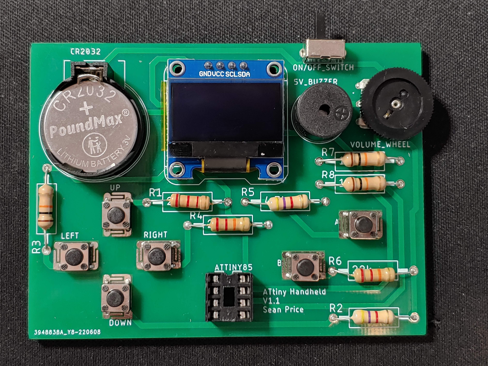

# ATtiny Handheld Games Console

## Table of Contents

- [Introduction](#introduction)
- [Board Manager & Programming Setup](#board-manager---programming-setup)
- [Circuitry](#circuitry)
  * [Schematic](#schematic)
  * [PCB Design](#pcb-design)
  * [Soldered PCB](#soldered-pcb)
- [Code](#code)
- [Enclosure](#enclosure)
  * [CAD Enclosure](#cad-enclosure)
  * [3D Printed Enclosure](#3d-printed-enclosure)
- [Game Library](#game-library)
- [Further Work](#further-work)
  * [PCB Changes](#pcb-changes)
  * [Version 2 - Featuring the Pico](#version-2---featuring-the-pico)

## Introduction

My aim is to create a handheld games console, based on the ATtiny85 AVR microcontroller. Users will be able to program their own games and play them anywhere. The long-term goal for this project is to create a library of games, and it would be amazing to build a community of users who can upload their games for others to download and play.

## Board Manager & Programming Setup

I am using the ATTinyCore board manager (https://github.com/SpenceKonde/ATTinyCore) with the following settings:

 

Currently I am programming the ATtiny using an Arduino Uno as a programmer. You could either do this or use a dedicated ISP programmer.

## Circuitry

### Schematic

 

### PCB Design

|  |  |
| ------------------------------------------------ | ----------------------------------------------------- |
|                    |                    |

### Soldered PCB

 

## Code

This repostitory includes code to test that the buttons and display are working correctly. When you press a button the display should show the analog value on the actionButton and directionButton pins, along with the name of the button pressed. Recognised buttons are as follows:

- UP

- DOWN

- LEFT

- RIGHT

- UP_LEFT

- UP_RIGHT

- DOWN_LEFT

- DOWN_RIGHT

- A

- B
  
  

  
  

## Enclosure

### CAD Enclosure

  
  

### 3D Printed Enclosure

|  |  |  |
| --------------------------------------- | ---------------------------------------- | ---------------------------------------- |

## Game Library

This is where you can find all of the games made for the console.

- [Astro Barrier](https://github.com/SeanP2001/ATtiny_Astro_Barrier)
- [Snake](https://github.com/SeanP2001/ATtiny_Snake)

## Further Work

### PCB Changes

Next time I order PCBs I would like to make some changes to the design:

- Use wider, hand-routed traces

- Remove the reverse voltage protection diode

- Make the volume wheel pads smaller

- Add mounting holes for screws

- Add a ground plane

- Change to using an angled power switch (standard part)

### Version 2 - Featuring the Pico

I have realised that this project is not as accessible as I would like. Programming an ATtiny could be a complicated and off-putting task for a beginner. The initial goal of this project was to make a platform for people to practice programming. 

To make a more accessible platform I think I need to switch to using a USB programmable board. An ideal candidate for this is the Raspberry Pi Pico because you can just plug it into your computer and program it using MicroPython or C++. 

However, using the Pico brings it's own challenges. For instance:

- Not all Arduino libraries are compatible (might be fixable with a compatability layer)

- A coin cell battery will no longer be adequate

- You cannot change games without re-programming the board
