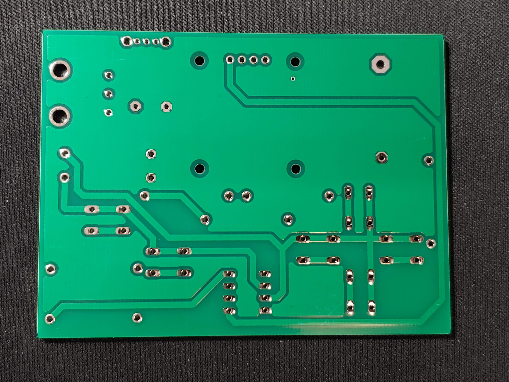

# ATtiny Handheld Games Console

## Table of Contents

- [Introduction](#introduction)
- [Circuitry](#circuitry)
  * [Schematic](#schematic)
  * [PCB Design](#pcb-design)
    + [Button Footprints](#button-footprints)
    + [Display Pinout Jumpers](#display-pinout-jumpers)
  * [Soldered PCB](#soldered-pcb)
- [Board Manager & Programming Setup](#board-manager---programming-setup)
- [Code](#code)
- [Enclosure](#enclosure)
  * [CAD Enclosure](#cad-enclosure)
  * [3D Printed Enclosure](#3d-printed-enclosure)
- [Game Library](#game-library)
- [Further Work](#further-work)
  * [Version 2 - Featuring the Pico](#version-2---featuring-the-pico)

## Introduction

My aim is to create a handheld games console, based on the ATtiny85 AVR microcontroller. Users will be able to program their own games and play them anywhere. The long-term goal for this project is to create a library of games, and it would be amazing to build a community of users who can upload their games for others to download and play.

## Circuitry

### Schematic

 

### PCB Design

|  |  |
| ------------------------------------------------ | ----------------------------------------------------- |
|                    |                    |

#### Button Footprints

I designed the button footprint to give the option of using either tactile buttons or silicone button membranes. However, after experimenting I have found that silicone buttons will never work with this design. The analog value recieved by the microcontroller varies wildly depending on the pressure applied to the button. This makes silicone buttons unusable. **Please use tactile buttons when assembling the PCB**. In the next PCB revision, I intend to remove the contact pads and return to a regular tactile button footprint.

#### Display Pinout Jumpers

Another feature of the PCB is the jumper connections under the display. The I2C OLED displays do not all have the same pin layout. When you buy a display online, the item you recieve may not have the same pinout as the one in the photos. Due to this inconsistency I have designed the board to work with both pinouts. If your display has the pinout (in order) Vcc/GND/SCL/SDA then you need to use solder to bridge the middle pads to the upper pads (shown blue below). If it is GND/Vcc/SCL/SDA then you need to bridge the middle pads to the lower pads (shown red below). Once you have done this, use Kapton tape to insulate the solder bridges and prevent them from causing a short circuit on the back of the display.

 

### Soldered PCB

 

## Board Manager & Programming Setup

I am using the ATTinyCore board manager ([GitHub - SpenceKonde/ATTinyCore: Arduino core for ATtiny 1634, 828, x313, x4, x41, x5, x61, x7 and x8](https://github.com/SpenceKonde/ATTinyCore)) with the following settings:

Currently I am programming the ATtiny using an Arduino Uno as a programmer. You could either do this or use a dedicated ISP programmer.

## Code

This repostitory includes code to test that the buttons and display are working correctly. When you press a button the display should show the analog value on the actionButton and directionButton pins, along with the name of the button pressed. Recognised buttons are as follows:

- UP

- DOWN

- LEFT

- RIGHT

- UP_LEFT

- UP_RIGHT

- DOWN_LEFT

- DOWN_RIGHT

- A

- B
  
  

  
  

## Enclosure

### CAD Enclosure

  
  

### 3D Printed Enclosure

|  |  |  |
| --------------------------------------- | ---------------------------------------- | ---------------------------------------- |

## Game Library

This is where you can find all of the games made for the console.

- [Astro Barrier](https://github.com/SeanP2001/ATtiny_Astro_Barrier)
- [Snake](https://github.com/SeanP2001/ATtiny_Snake)

## Further Work

Next time I order PCBs I will remove the contact pads and return to a regular tactile button footprint. I will also remove the silicone button membranes and alignment pins from the enclosure design. I may make small alterations to the height of the buttons along with minimising the gaps around the volume wheel and on/off switch.

### Version 2 - Featuring the Pico

I have realised that this project is not as accessible as I would like. Programming an ATtiny could be a complicated and off-putting task for a beginner. The initial goal of this project was to make a platform for people to practice programming. 

To make a more accessible platform I think I need to switch to using a USB programmable board. An ideal candidate for this is the Raspberry Pi Pico because you can just plug it into your computer and program it using MicroPython or C++. 

However, using the Pico brings it's own challenges. For instance:

- Not all Arduino libraries are compatible (might be fixable with a compatability layer)

- A coin cell battery will no longer be adequate

- You cannot change games without re-programming the board
