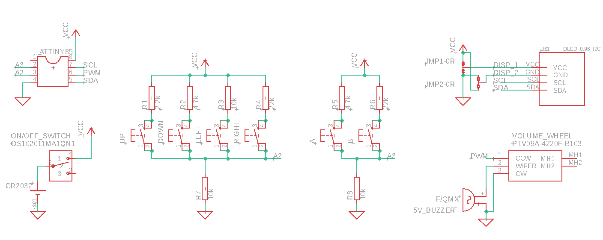
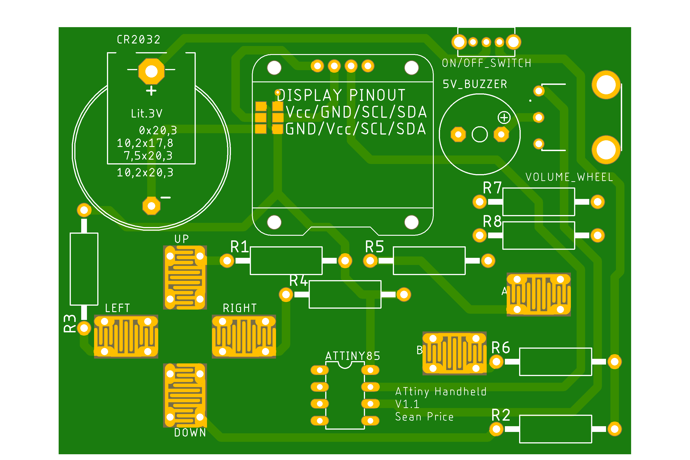
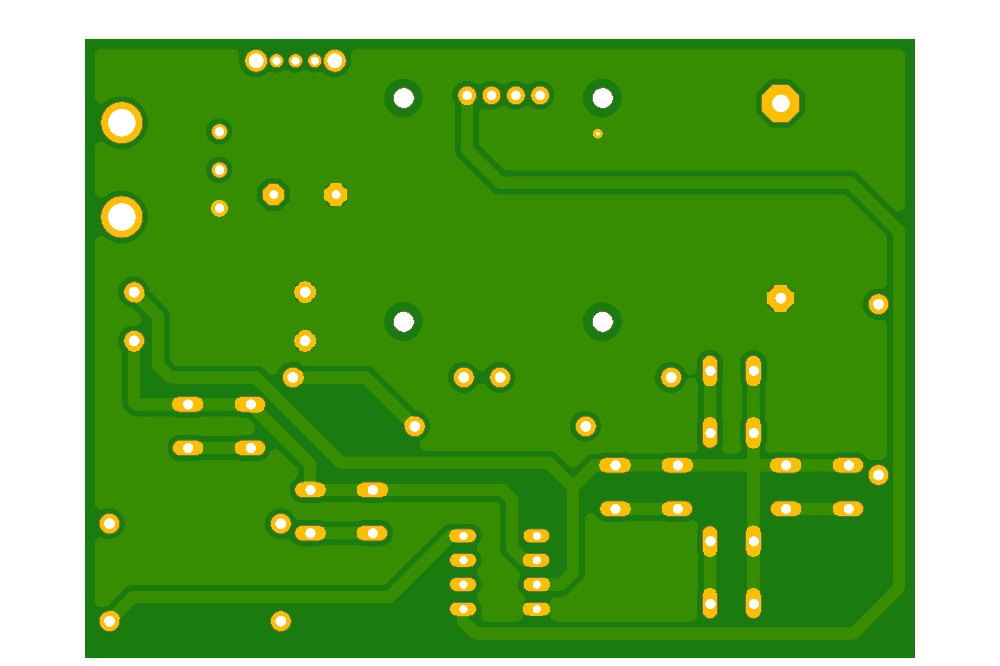

# ATtiny Handheld Games Console

## Table of Contents

- [Introduction](#introduction)
- [Board Manager & Programming Setup](#board-manager---programming-setup)
- [Circuitry](#circuitry)
  * [Schematic](#schematic)
  * [PCB Design](#pcb-design)
  * [Soldered PCB](#soldered-pcb)
- [Code](#code)
- [Enclosure](#enclosure)
  * [CAD Enclosure](#cad-enclosure)
  * [3D Printed Enclosure](#3d-printed-enclosure)
- [Game Library](#game-library)
- [Further Work](#further-work)

## Introduction

My aim is to create a handheld games console, based on the ATtiny85 AVR microcontroller. Users will be able to program their own games and play them anywhere. The long-term goal for this project is to create a library of games and it would be amazing to build a community of users who can upload their games for others to download and play.

## Board Manager & Programming Setup

I am using the ATTinyCore board manager (https://github.com/SpenceKonde/ATTinyCore) with the following settings:

 

Currently I programming the ATtiny using an arduino uno as a programmer. You could either do this or use a dedicated ISP programmer.

## Circuitry

This is the V1 circuitry. I have multiple things which I would like to change but this is the current design.

### Schematic

 

### PCB Design

|  |  |
| ------------------------------------------------ | ----------------------------------------------------- |
|                    |                    |

### Soldered PCB

 

## Code

This repostitory includes code to test that the buttons and display are working correctly. When you press a button the display should show the analog value on the actionButton and directionButton pins, along with the name of the button pressed. Recognised buttons are as follows:

- UP
- DOWN
- LEFT
- RIGHT
- UP_LEFT
- UP_RIGHT
- DOWN_LEFT
- DOWN_RIGHT
- A
- B

 

 

## Enclosure

### CAD Enclosure

### 3D Printed Enclosure

## Game Library

## Further Work
